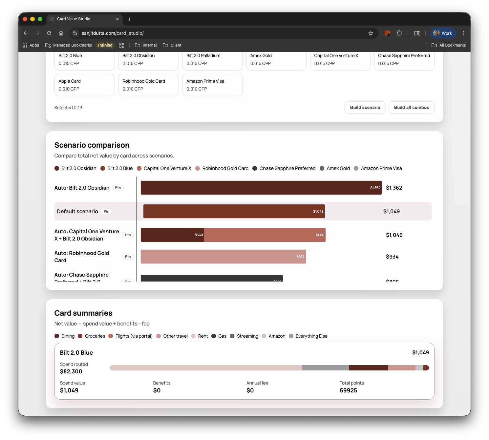

# Vibecoding Changed What I Can Build

- Vibecoding turned a structured logic problem into working software, fast
- This is materially different from brainstorming in ChatGPT
- Extrapolation: many software ideas that were too slow to build are now viable

Presenter: Sanjit Dutta
Date: Feb 2026
Takeaway: Vibecoding lowers the activation energy of software creation.

---

# The Problem and the Product

- Rewards program changes made my wallet strategy obsolete
- I built a tool to test card portfolio setups and spend-routing scenarios
- The app stores inputs locally so users can iterate and compare over time

- Demo link: `https://lnkd.in/ew2dtgms`
- Repo for bugs: `https://lnkd.in/ejAyzACp`

Takeaway: Real user pain can now be translated into software in a single session.

---

# Proof That This Is Real

- First working application: **10 minutes**
- Prior build estimate for similar outcome: **40+ hours**
- Actual total to solid state: **~8 hours** with intermittent refinement
- Business outcome from using the app: **$300+ annual wallet upside**

Takeaway: Time-to-value compression is real for both builders and end users.

---

# Where Vibecoding Breaks Down

- Dead code and legacy artifacts accumulate quickly (e.g., vestigial Mongo code)
- Complex implementation paths often need to be blocked or rewritten
- Debug loops can waste time and increase technical debt
- Front-end responsiveness and visualization quality still required manual takeover

Takeaway: AI-generated code is fast code, not automatically good code.

---

# Production Guardrails Are Non-Negotiable

- Secrets and repository hygiene
- Security and API hardening
- High availability and reliability controls

- Working model: free-form for POCs, structured step-by-step for production

Takeaway: Speed scales only when governance scales with it.

---

# Implications for PE Tech Strategy Teams

- Evaluate AI code quality explicitly, not just output velocity
- Developer productivity gains are real and should be quantified in value-creation plans
- Agentic workflows can push delivery toward semi-autonomous execution
- In diligence, assess AI velocity and software governance together

Takeaway: The new diligence question is not "Is AI used?" but "Is it governed?"

---

# Disclaimer and Call to Action

- This deck itself was vibecoded, then edited and quality-controlled by me
- The same pattern applies to delivery: rapid generation plus disciplined review
- You do not need to be a traditional engineer to start learning this workflow

- Team ask: test Codex, Claude, or GitHub Copilot today and bring one client-relevant insight back

Takeaway: Start using it now, but operate it like a professional software team.
